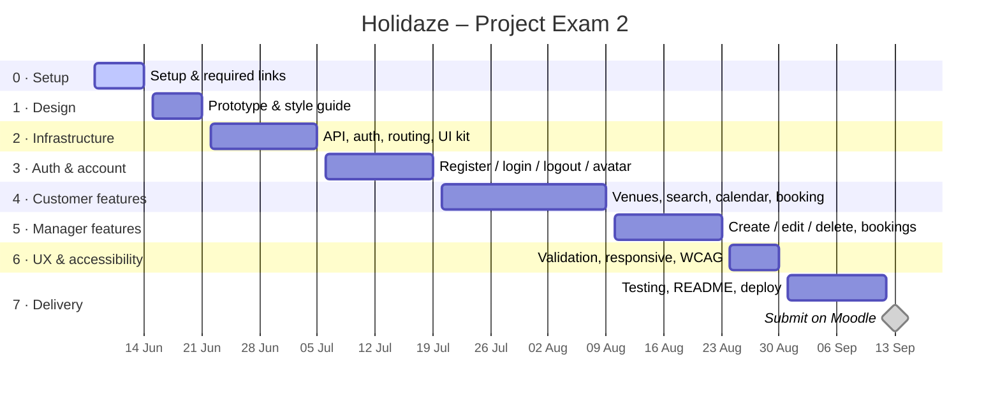

# Holidaze — Gantt Chart

Project timing for Project Exam 2, June 8 – September 13, 2026.
The board with live status lives in [GitHub Projects](https://github.com/users/Daniel-leiken/projects/2).

## Phase breakdown

| Phase | Focus | Start | End |
|-------|-------|-------|-----|
| 0 | Setup & required links | Jun 8 | Jun 14 |
| 1 | Design: prototype & style guide | Jun 15 | Jun 21 |
| 2 | Core infrastructure | Jun 22 | Jul 5 |
| 3 | Auth & user account | Jul 6 | Jul 19 |
| 4 | Customer venue features | Jul 20 | Aug 9 |
| 5 | Venue manager features | Aug 10 | Aug 23 |
| 6 | UX, accessibility & validation | Aug 24 | Aug 30 |
| 7 | Testing, docs & delivery | Aug 31 | Sep 13 |

See [PROJECT-PLAN.md](PROJECT-PLAN.md) for the task-level breakdown behind each phase.
